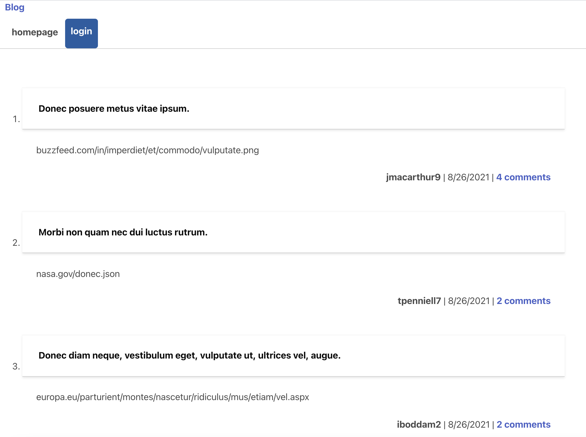
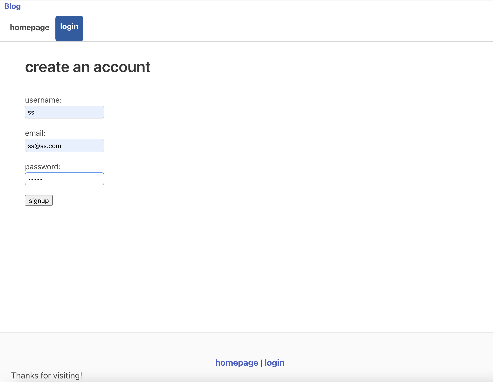
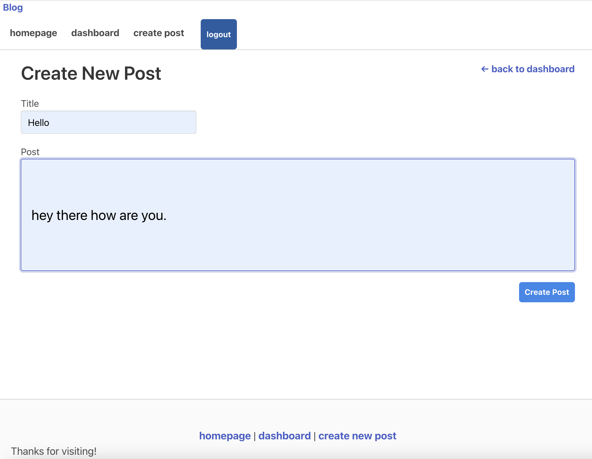
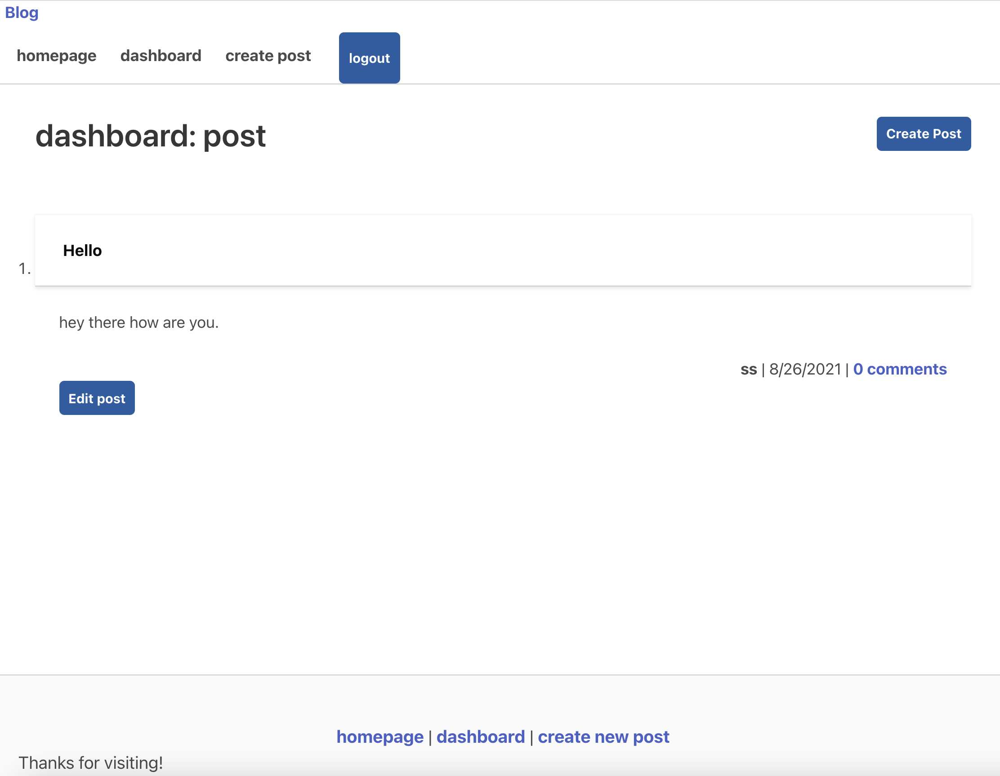
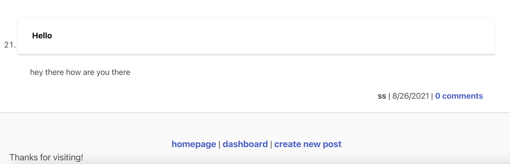
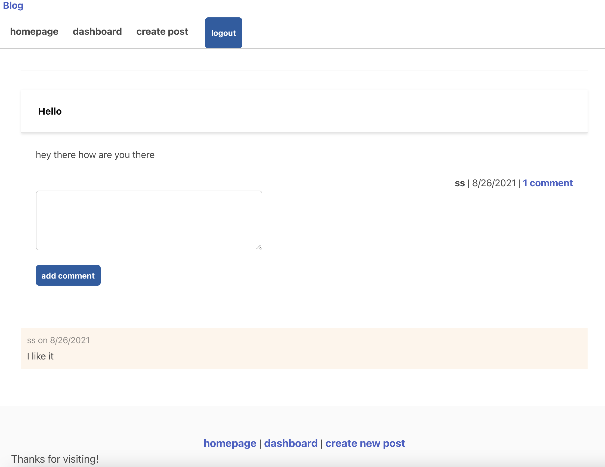
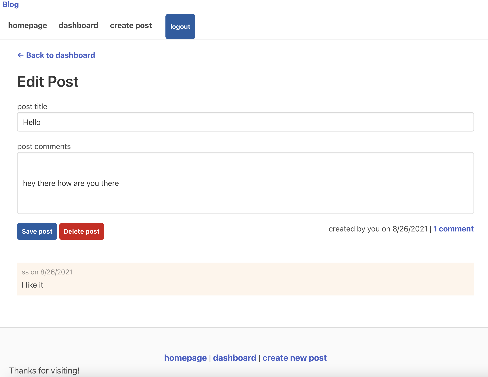

# blog

## About this challenge
As a developer who writes about tech, the user wants a CMS-style blog site, so that they can publish articles, blog posts, and thoughts and opinions.

## In this Challenge

- GIVEN a CMS-style blog site
- When the user visit the site for the first time, then presented with the homepage, which includes existing blog posts if any have been posted; navigation links for the homepage and the dashboard; and the option to log in.

- When the user clicks on the homepage option, then taken to the homepage.

- When the user clicks on any other links in the navigation, then prompted to either sign up or sign in.

- When the user chooses to sign up, then  prompted to create a username and password.

- When the user clicks on the sign-up button, then my user credentials are saved and  logged into the site.

- When the user revisit the site at a later time and choose to sign in, then  prompted to enter my username and password.

- When  signed in to the site, then the user see navigation links for the homepage, the dashboard, and the option to log out.

- When the user click on the homepage option in the navigation, then  taken to the homepage and presented with existing blog posts that include the post title and the date created.

- When the user click on an existing blog post, then  presented with the post title, contents, post creator’s username, and date created for that post and have the option to leave a comment.

- When the user enter a comment and click on the submit button while signed in, then the comment is saved and the post is updated to display the comment, the comment creator’s username, and the date created.

- When the user click on the dashboard option in the navigation, then  taken to the dashboard and presented with any blog posts the user have already created and the option to add a new blog post.

- When the user click on the button to add a new blog post, then  prompted to enter both a title and contents for my blog post.

- When the user click on the button to create a new blog post, then the title and contents of my post are saved and  taken back to an updated dashboard with my new blog post.

- When the user click on one of my existing posts in the dashboard, then  able to delete or update my post and taken back to an updated dashboard.

- When the user click on the logout option in the navigation, then  signed out of the site.

- When  idle on the site for more than a set time, then  able to view comments but  prompted to log in again before the usercan add, update, or delete comments.

## blog Demo

## Deployed Site
 https://sindhu-techblog.herokuapp.com/
 
 https://github.com/sindhu-sp/blog

## Technologies Used:
- MySQL2
- Sequelize
- express-handlebars
- CSS
- Bulma

#### Sindhu Pillai